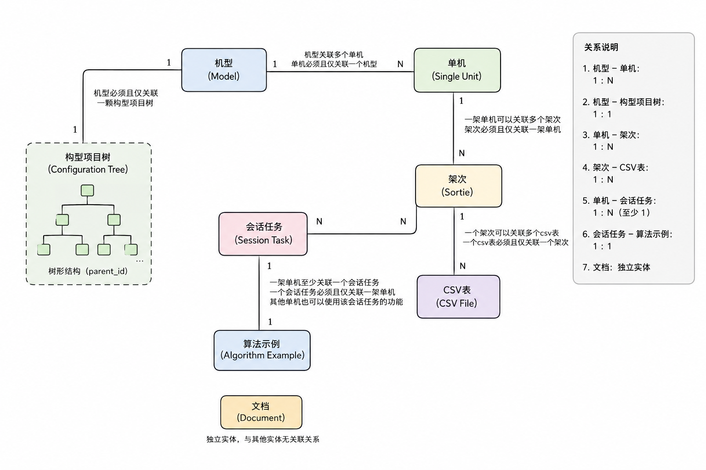

# PHM 开放式架构平台

## 项目描述

基于 Vue 3 的 PHM（故障预测与健康管理）开放式架构平台前端。围绕 **机型 → 单机 → 架次 → 构型项目 → CSV 数据 → 算法实例 → 会话任务** 的领域模型，提供构型管理、飞行数据管理、算法训练 / 推理、LLM 流式对话、可配置数据看板与知识库管理等能力，并内置一套完整的军用飞机 PHM 业务演示。

---

## 关键实体关系

1. 一个机型可以关联多个单机，一个单机必须且仅关联一个机型

2. 一个机型必须且仅关联一颗构型项目树，其中各构型项目以树形结构组织（存在parent_id属性）

3. 一架单机可以关联多个架次，一个架次必须且仅关联一架单机

4. 一个架次可以关联多个csv表，一个csv表必须且仅关联一个架次（“一个csv表”的定义为：csv文件名一致）

5. 一架单机至少关联一个会话任务（进入会话管理自动创建），一个会话任务必须且仅关联一架单机，但其他单机也可以使用该会话任务的功能

6. 一个会话任务必须且仅关联一个算法示例

7. 文档为该系统的独立实体与其他实体没有关联关系

   

## 技术栈

| 分类        | 技术                                           | 版本              | 用途                                       |
| ----------- | ---------------------------------------------- | ----------------- | ------------------------------------------ |
| 核心        | Vue 3                                          | ^3.5              | 框架（Composition API + `<script setup>`） |
| 核心        | TypeScript                                     | ~6.0              | 类型安全                                   |
| 构建        | Vite                                           | ^8.0              | 构建 / 开发服务器                          |
| 构建        | unplugin-auto-import / unplugin-vue-components | ^21 / ^32         | Element Plus 按需自动导入与组件注册        |
| 路由 / 状态 | Vue Router                                     | ^4.6              | 客户端路由                                 |
| 路由 / 状态 | Pinia                                          | ^3.0              | 状态管理                                   |
| UI          | Element Plus                                   | ^2.14             | 组件库                                     |
| UI          | @element-plus/icons-vue                        | ^2.3              | 图标                                       |
| 可视化      | ECharts + vue-echarts                          | ^6.0 / ^8.0       | 2D 图表（折线 / 柱 / 饼 / 散点）           |
| 可视化      | echarts-gl                                     | ^2.1              | 3D 点云（数据展示）                        |
| 可视化      | D3                                             | ^7.9              | 构型项目构型图谱                           |
| 布局        | grid-layout-plus                               | ^1.1              | 数据看板可拖拽栅格                         |
| 文档        | @scalar/api-reference                          | ^1.60             | 算法实例 OpenAPI 文档渲染                  |
| 渲染        | markdown-it / katex / highlight.js             | ^14 / ^0.17 / ^11 | 对话 Markdown / 公式 / 代码高亮            |

---

## 后端服务与代理

开发环境通过 Vite `server.proxy` 将 五个前缀转发到不同后端（[vite.config.ts](vite.config.ts)）：

| 前缀        | 转发目标                       | rewrite          | 用途                                                         | 前端模块                                    | 负责人 |
| ----------- | ------------------------------ | ---------------- | ------------------------------------------------------------ | ------------------------------------------- | -------------------------- |
| `/api`      | `http://152.136.119.117:8080/` | 去掉 `/api`      | 数据获取/处理模块 | aircraft / csv | 许浩然 |
| `/instance` | `http://192.168.31.13:8001`    | 去掉 `/instance` | 数据分析模块           | instance / instance-worker                  | 孙中杰 |
| `/task`     | `http://127.0.0.1:8000`        | `/task` → `/api` | 数据展示/桥接模块                               | task / display                     | 康宇翔 |
| `/opencode` | `http://192.168.31.13:8001`    | 不重写           | 智能体内核                         | opencode                                | 康宇翔 |
| `/document` | `http://192.168.31.178:8001` | `/document`→`/api` | 文档 / 检索 | document | 华晓飞 |

> 注：instance模块在源代码轴也走了/api代理入口，属于历史遗留问题。但是实际上该模块接口应用极少，开发中可忽略，部署中由反代网关转发策略解决

接口域概览（详细字段见各 `src/api/*.ts`）：

| 域          | 代表接口                                                     |
| ----------- | ------------------------------------------------------------ |
| 机型 / 单机 | `GET/POST /aircraft/models`、`GET/POST /aircraft/plane`、`GET /aircraft/aircraft-numbers` |
| 架次        | `GET/POST /aircraft/sorties`、`DELETE /aircraft/sorties/{id}` |
| 构型项目    | `GET /aircraft/config-items[/tree\|/select-list]`、`POST/DELETE /aircraft/config-items` |
| 数据映射    | `GET /aircraft/mappings`                                     |
| CSV         | `POST /csv/preview`、`POST /csv/upload`、`GET /csv/overview`、`POST /csv/drop` |
| 会话任务    | `GET /tasks/aircraft/{id}`、`POST/DELETE/PUT /tasks`、`POST /tasks/train`、`POST /tasks/infer` |
| 实例管理    | `GET /highlevel`（启动）、`DELETE /highlevel/{id}`、`GET /highlevel/{id}/restart` |
| 实例 Worker | `POST /load\|/unload\|/save\|/train\|/infer`、`GET /state/{n}`、`GET /stop`、`GET /wait` |
| 数据展示    | `POST /display/raw-data`                                     |
| 知识库      | `POST /documents/upload`、`GET /documents`、`DELETE /documents/{id}`、`POST /retrieval[/dense\|/sparse]` |

> 部分接口文件头部注释里的 IP 与实际代理不一致时，**以 `vite.config.ts` 为准**。

---

## 快速开始

```bash
# 安装依赖
npm install

# 启动开发服务器（默认 http://localhost:5173）
npm run dev

# 类型检查
npm run typecheck

# 类型检查 + 生产构建
npm run build:check

# 仅构建
npm run build

# 预览生产构建
npm run preview
```

> ⚠️ 开发模式下，前端依赖五个后端服务（见 [后端服务与代理](#后端服务与代理)）。若对应服务未启动，相关页面会出现请求失败；工作区内的 6 个演示页签为纯前端 Mock，无需任何后端即可浏览。（注：进入单机工作区也需要实际的业务主服务提供单机数据，因此**尽量保证业务主后端至少是开的**）

---

## 整体架构

```
┌──────────────────────────────────────────────────────────────────────┐
│                            浏览器（Vue SPA）                           │
│  views / components  ──►  Pinia stores  ──►  src/api/*  ──►  fetch
└──────────────────────────────────────────────────────────────────────┘
      │          │          │            │             │
      ▼          ▼          ▼            ▼             ▼   （Vite dev proxy）
 /api 主后端  /instance 实例  /task 展示  /opencode 对话  /document 文档检索
```

- **`src/api/`**：基于 `fetch` 的可实例化 HTTP 客户端**（[client.ts](src/api/client.ts) 提供 `createClient({ baseURL })` 工厂）**，按业务域拆分模块。
- **`src/stores/`**：Pinia store 编排跨服务流程（如「创建会话」用例需依次调用实例管理、OpenCode、任务后端三个服务）。
- **`src/views` + `src/components`**：页面与组件，通过路由或工作区菜单切换。

---

## 项目结构

```
src/
├── api/                       #   HTTP 接口层（按域拆分，基于 client.ts）
│   ├── client.ts              #   可实例化 fetch 客户端 + ApiError + 超时
│   ├── aircraft.ts            #   机型 / 单机 / 架次 / 构型项目 / 数据映射
│   ├── csv.ts                 #   CSV 分析 / 预览 / 上传 / 删表
│   ├── task.ts                #   会话任务 CRUD / 训练 / 推理
│   ├── instance.ts            #   算法实例进程管理（pmgr）
│   ├── instance-worker.ts     #   实例内模型操作（load/train/infer/state…）
│   ├── display.ts             #   数据看板图表查询
│   ├── document.ts            #   知识库文档 + 混合检索
│   └── opencode.ts            #   OpenCode HTTP + SSE 封装（对话服务）
├── config/
│   └── endpoints.ts           #   统一 API 端点前缀（API_PREFIX，与 vite proxy 对齐）
├── stores/                    #   Pinia
│   ├── aircraft.ts            #   机型 / 单机列表
│   ├── configItem.ts          #   构型项目树
│   ├── dataMapping.ts         #   CSV 上传 / 分析 / 删除
│   ├── task.ts                #   会话任务全生命周期（跨服务编排）
│   ├── chat.ts                #   OpenCode 连接 / 会话 / 消息 / SSE
│   ├── knowledge.ts           #   知识库文档
│   ├── demoAppStore.ts        #   演示用飞机 / 机队选择（Mock）
│   └── app.ts                 #   全局 UI 选中态
├── views/
│   ├── HomeView.vue           # 首页+飞行器管理（4 个一级菜单）
│   ├── AircraftWorkspace.vue  # 单机工作区（点击"飞行器管理"进入，9 个菜单）
│   ├── ConfigManagement.vue   # 构型管理（构型项目树 / 力导向图）
│   ├── MonitorView.vue        # 数据展示（可配置看板）
│   ├── DocumentView.vue       # 知识库管理
│   ├── ApiDocsView.vue        # 算法实例接口文档（Scalar，从会话管理 -> 接口文档进入）
│   └── demo/                  # 6 个 PHM 演示页（纯 Mock，这六个组件都在AircraftWorkspace内）
├── components/
│   ├── SideNav.vue							# HomePage侧边导航栏
│   ├── WorkspaceSidebar.vue				# AircraftWorkspace侧边导航栏
│   ├── AircraftCard.vue 					# 飞行器管理 -> 单机卡片
│   ├── AddAircraftDialog.vue				# 飞行器管理 -> 添加飞行器弹窗表单
│   ├── ChatPanel.vue, MessageFeed.vue     # 对话入口
│   ├── MessageFeed.vue     				# 对话入口 -> 消息展示组件
│   ├── TaskPanel.vue					      # 会话管理
│   ├── TaskDialog.vue      				# 会话管理 -> 新建会话弹窗表单
│   ├── DataPanel.vue					      # 数据管理
│   ├── CsvPreview.vue      				# 数据管理 -> CSV分析
│   ├── SortieDialog.vue                   # 数据管理 -> 架次管理
│   ├── TrainingDialog.vue, InferingDialog.vue   # 去训练 / 去推理
│   ├── ConfigForceGraph.vue               # 构型力导向图（D3）
│   ├── dashboard/                         # 数据看板（栅格 + ECharts）
│   └── demo/                              # 演示组件
├── mock/demo/                 # 演示 Mock 数据（planes/realtime/health/...）
├── types/entities.ts          # 核心实体与后端 DTO 类型
├── utils/                     # 图表配置 / 看板工具 / Markdown 渲染
└── router/index.ts            # 路由（仅 3 条）
```

---

## 路由

| 路径                        | 名称               | 页面                                          |
| --------------------------- | ------------------ | --------------------------------------------- |
| `/`                         | home               | 首页（飞行器 / 知识库 / 构型 / 数据展示）     |
| `/aircraft/:aircraftNumber` | aircraft-workspace | 单机工作区                                    |
| `/algo-docs/:instanceId`    | algo-docs          | 算法实例接口文档（新标签页打开，Scalar 渲染） |

> ⚠️ **路由路径不得以 `/api`、`/instance`、`/task`、`/opencode` 开头**——它们是 Vite 代理前缀，会被直接转发到后端而无法命中前端路由。

---

## 功能模块

### 一、首页（`/`，[HomeView.vue](src/views/HomeView.vue)）

采用 **左侧 15% 导航栏 + 右侧内容区** 布局，深蓝工业风主题，侧栏可折叠。一级菜单 4 项：

| 菜单       | 组件                                               | 说明                                                  |
| ---------- | -------------------------------------------------- | ----------------------------------------------------- |
| 飞行器管理 | 内嵌卡片网格                                       | 单机列表，按构型筛选 + 关键字搜索，点击卡片进入工作区 |
| 知识库管理 | [DocumentView](src/views/DocumentView.vue)         | 文档上传与管理                                        |
| 构型管理   | [ConfigManagement](src/views/ConfigManagement.vue) | 构型项目树管理                                        |
| 📡 数据展示 | [MonitorView](src/views/MonitorView.vue)           | 可配置数据看板                                        |

#### 1.1 飞行器管理

- **按构型筛选**：选择机型（`modelCode`）后重新拉取该构型下的单机列表。
- **实时搜索**：匹配机号、构型代码、航司。
- **添加飞行器**（[AddAircraftDialog](src/components/AddAircraftDialog.vue)）：机号（必填）、构型（必填，可在弹窗内「新建构型」）、航司、构型版本、状态（活跃 / 已退役 / 维护中）。

#### 1.2 构型管理

构型（机型 `modelCode`）下维护一棵 **构型项目树**（`ConfigItem`），节点类型按 ATA/GJB 体系分四级：

```
SYSTEM ──► SUBSYSTEM ──► EQUIPMENT / LRU
```

每个节点包含：ATA 章节号（必填）、名称、件号（EQUIPMENT/LRU）。提供两种视图：

- **树形视图**（`el-tree`）：展开 / 高亮，节点上可直接「添加子项 / 删除」（按父节点类型约束可选子类型）。
- **力导向图视图**（[ConfigForceGraph](src/components/ConfigForceGraph.vue)，D3）：以机型为根，交互式增删子项。

支持新建构型项目、删除项目（级联删除子项）、删除整个构型。

#### 1.3 知识库管理

上传与管理知识库文档（支持 `.md` / `.txt` / `.pdf`）。展示文档大小、分块数、上传时间；每 3 秒轮询文档列表；支持删除。底层 `document.ts` 同时提供混合检索能力（dense 向量 + BM25，RRF 融合）供对话侧调用。

#### 1.4 数据展示（可配置看板）

详见 [§ 可配置数据看板](#可配置数据看板monitorview)。

---

### 二、单机工作区（`/aircraft/:aircraftNumber`，[AircraftWorkspace.vue](src/views/AircraftWorkspace.vue)）

进入后自动初始化该单机的任务上下文：拉取会话列表，若无专属会话则**静默自动创建默认会话**，随后切到「当前对话」。侧栏 9 个菜单：

| 菜单       | 组件                                      | 数据源   | 说明                              |
| ---------- | ----------------------------------------- | -------- | --------------------------------- |
| 🗂️ 会话管理 | [TaskPanel](src/components/TaskPanel.vue) | 真实后端 | 会话 / 实例 / 训练推理状态        |
| 📦 数据管理 | [DataPanel](src/components/DataPanel.vue) | 真实后端 | 架次 + CSV 上传 / 去训练 / 去推理 |
| 💬 当前对话 | [ChatPanel](src/components/ChatPanel.vue) | OpenCode | LLM 流式对话                      |
| 📡 实时监控 | DemoRealtimeView                          | Mock     | 关键参数看板 + 告警               |
| 🩺 增强诊断 | DemoDiagnosisView                         | Mock     | 飞参判读 + 地面综合诊断           |
| ❤️ 健康评估 | DemoHealthView                            | Mock     | 健康树 + 隐身评估 + 放飞支持      |
| 📈 趋势分析 | DemoTrendView                             | Mock     | 到检信息 + 整机 / 系统趋势        |
| 🔮 故障预测 | DemoPredictionView                        | Mock     | 寿命监控 + 故障风险预测           |
| 🔧 维修建议 | DemoMaintenanceView                       | Mock     | 故障信息 + 排故步骤 + IETM        |

> 前 3 项为真实业务，后 6 项为**纯前端 Mock 演示**（围绕 J-20 有人机 P001–P004、无人机-A P005–P006 的完整 PHM 业务闭环），不调用任何后端。

#### 2.1 会话管理（[TaskPanel](src/components/TaskPanel.vue)）

「会话（Task）」是工作区的核心编排单元，一条会话同时绑定：OpenCode 会话（`session_id`）、算法实例（`instance_id`）、工作目录（`work_dir`）与所属单机。

- 会话列表 + 关键字搜索；**默认会话**不可删除。
- **状态轮询**：每 500ms 经实例 Worker 拉取各会话状态（未加载 / 已加载 / 训练中 / 推理中），训练 / 推理时显示 **epoch + batch 双层进度条**、耗时、速率与预计剩余时间。
- 创建会话（[TaskDialog](src/components/TaskDialog.vue)）：自动完成「启动实例 → 推导工作目录 → 创建 OpenCode 会话 → 落库」五步编排，过程文案实时反馈。
- 单会话操作：**进入对话**、**推理结果**（查询并表格展示 outputs/ids）、**接口查询**（新标签页打开该实例的 Scalar 文档）、**会话删除**（级联清理 OpenCode 会话与实例）。

#### 2.2 数据管理（[DataPanel](src/components/DataPanel.vue)）

管理单机的 **架次（Sortie）** 及其关联的 **CSV 数据表**（一个架次可关联多张表）。

- **CSV 上传**：选择文件 → 填表名 → 选关联架次（必选）→ 可选关联构型项目；「分析预览」展示行数 / 有效行 / 列类型校验；上传后入库为 `csv_<表名>` 表并建立数据映射。
- **架次管理**：列表展示架次号 / 飞行日期 / 起止时间，展开行查看其下全部数据表；支持添加架次（[SortieDialog](src/components/SortieDialog.vue)）、删除架次（级联删表）、单表删表。
- **去训练 / 去推理**：每张数据表可触发 [TrainingDialog](src/components/TrainingDialog.vue) / [InferingDialog](src/components/InferingDialog.vue)，基于该表列在当前会话的实例上发起训练 / 推理，完成后跳转会话管理查看进度与结果。

#### 2.3 当前对话（[ChatPanel](src/components/ChatPanel.vue)）

详见 [§ OpenCode 对话集成](#opencode-对话集成)。

---

### 可配置数据看板（MonitorView）

首页「数据展示」的 [MonitorView](src/views/MonitorView.vue) 提供基于真实 CSV 数据的可视化看板：

- **布局**：左侧画布 + 右侧 340px 数据源配置侧栏（可收起）。画布基于 `grid-layout-plus`（12 列 × 30 行栅格），支持拖拽、缩放、**锁定 / 解锁布局**、**一键优化排版**。
- **数据源级联选择**：单机 → 架次 → 数据映射 → 列；按图表类型选择 X / Y / Z 轴（跨轴去重），设置数据点上限与窗口大小。
- **图表类型**：单参数时序 2D、多参数时序 2D、二维映射 2D、**三维点云 3D**（依赖 echarts-gl）；样式可选折线 / 散点 / 柱状 / 面积。
- **数据查询**：经 `POST /task/display/raw-data` 拉取，后端将请求组装为 SQL 转发至 CSV 模块，返回序列化图表数据，前端用 `DisplayOptionBuilder` 转 ECharts option 渲染。
- 支持图表新增 / 原位编辑（回填配置）、删除（二次确认）。

---

## OpenCode 对话集成

对话能力通过 [opencode.ts](src/api/opencode.ts) 对接 [OpenCode](https://opencode.ai) 服务，不走通用 `client.ts`，自行实现 HTTP + `EventSource`。

- **连接配置**（[chat.ts](src/stores/chat.ts) `DEFAULT_OPTS`）：`base: '/opencode'`、`dir`、`user: 'opencode'`、`pass: ''`。每个会话连接时用该会话的 `workDir` 覆盖 `dir`，即**每个会话连到各自工作目录**。
- **REST**：健康检查、模型列表、会话 CRUD、`POST /session/:id/prompt_async`（异步发消息，回复走 SSE）、`POST /session/:id/abort`（中止）、`POST /question/:id/reply\|/reject`（AI 提问交互）。
- **SSE 流式**（`GET /event`）：按事件类型分发——
  - `message.part.delta`：增量 token，缓冲后按 `requestAnimationFrame` 每帧合并，按消息聚合，避免逐 token 全量重渲染；
  - `message.updated` / `message.part.updated`：整条 / 单 part 补丁；
  - `session.status`：`idle` 时收尾对齐；
  - `question.asked/replied/rejected`：AI 主动提问交互。
  - 断线指数退避重连（3s 起、封顶 30s）。
- **消息渲染**：Markdown（加粗 / 斜体 / 代码 / 换行）、KaTeX 公式、highlight.js 代码高亮；区分普通文本 / 思考过程（reasoning，可折叠）/ 工具调用（tool，可折叠）。支持 `Ctrl+Enter` 快捷发送、中止生成、自动滚动。

---

## 状态管理（Pinia管理，位于stores目录下）

| Store              | 职责                                                         | 数据源   |
| ------------------ | ------------------------------------------------------------ | -------- |
| `aircraftStore`    | 机型 / 单机 / 机号列表 CRUD                                  | 真实后端 |
| `configItemStore`  | 构型项目树（扁平 / 树 / 下拉），按机型缓存                   | 真实后端 |
| `dataMappingStore` | CSV 上传 / 分析 / 删表流程                                   | 真实后端 |
| `taskStore`        | 会话任务全生命周期，跨 3 个服务编排；当前会话按单机经 cookie（`phm_current_task`）持久化 | 真实后端 |
| `chatStore`        | OpenCode 连接 / 会话 / 消息 / SSE 订阅 / 增量合并            | OpenCode |
| `knowledgeStore`   | 知识库文档管理                                               | 真实后端 |
| `demoAppStore`     | 演示飞机 / 机队选择                                          | 纯 Mock  |
| `appStore`         | 全局 UI 选中态                                               | 纯前端   |

---

## 构建优化

生产构建通过 `rollupOptions.output.manualChunks` 拆分 vendor 包（element-plus / element-plus-icons / echarts / d3 / vendor-utils），并降低 `chunkSizeWarningLimit`，控制首屏主包体积；同时抑制 element-plus → @vueuse/core 传递依赖的 `INVALID_ANNOTATION` 警告。

---

## 开发注意事项

- **路由前缀冲突**：vue-router 路径不可使用 `/api`、`/instance`、`/task`、`/opencode` 开头，否则被代理拦截。
- **新增接口**：在 `src/api/` 对应域文件中添加，`baseURL` 须与 `vite.config.ts` 代理前缀对齐；跨实例请求用 `instance-worker.ts` 的按实例缓存客户端。
- **演示模块**：6 个演示页签与真实业务完全解耦，仅依赖 `src/mock/demo/`；新增真实功能应走 store + api，不要混入演示数据。

---

## 后续开发任务

1. 在homepage新增一个调试外部平台/接口的页面，支持用户手动编辑url测试连通性
2. 会话管理界面新增选择列表支持不同应用场景下的不同智能算法
3. 算法的训/推结果可视化优化，使用分页而不是滚动形式
4. 数据源配置-》智能查询界面
5. BUG：数据展示界面曲线平滑取消/在更新图表后恢复了默认的窗口大小
6. 会话界面的加载动画
7. 会话窗口保持时可能会出现新消息加载不出来的情况